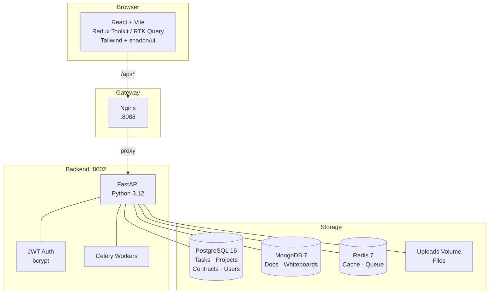
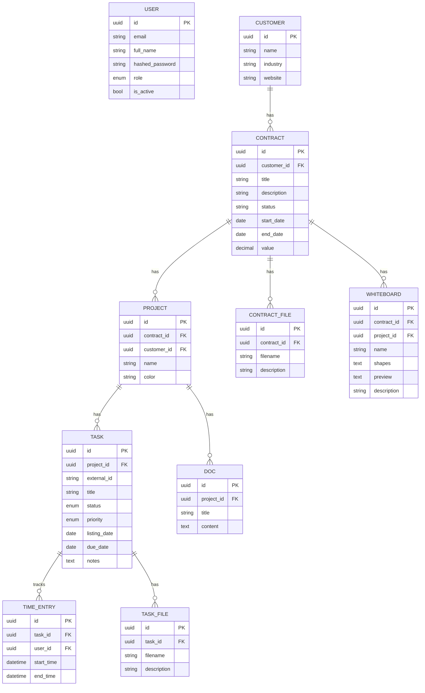

# Kanban Platform

A full-stack enterprise project management platform inspired by ClickUp and monday.com — built for consulting teams that need to track clients, contracts, projects and tasks in one place.

---

## Table of Contents

- [Overview](#overview)
- [Architecture](#architecture)
- [Data Model](#data-model)
- [Tech Stack](#tech-stack)
- [Features](#features)
- [Project Structure](#project-structure)
- [API Reference](#api-reference)
- [Roles & Permissions](#roles--permissions)
- [Getting Started](#getting-started)
  - [Docker (recommended)](#docker-recommended)
  - [Local Development](#local-development)
- [Excel Import Format](#excel-import-format)
- [TODO](#todo)

---

## Overview

The platform connects the business hierarchy — **Customer → Contract → Project → Task** — and surfaces it across multiple workspaces: Kanban board, Gantt chart, Timeline, Calendar, Time Tracking, Docs and a Vector Whiteboard.

---

## Architecture



---

## Data Model



---

## Tech Stack

### Backend

| | |
|---|---|
| Framework | FastAPI (Python 3.12) |
| ORM | SQLAlchemy 2 (async) |
| Primary DB | PostgreSQL 16 |
| Document DB | MongoDB 7 |
| Cache / Queue | Redis 7 + Celery |
| Auth | JWT access + refresh tokens, bcrypt |
| Gateway | Nginx |

### Frontend

| | |
|---|---|
| Framework | React 18 + Vite + TypeScript |
| Styling | Tailwind CSS + shadcn/ui |
| State | Redux Toolkit + RTK Query |
| Drag & Drop | @dnd-kit |
| Canvas | Konva.js / react-konva |
| Rich Text | React Quill |
| Export | xlsx, jsPDF |

---

## Features

| Feature | Description |
|---|---|
| **Dashboard** | Summary widgets: open tasks, overdue, time logged |
| **Kanban** | Drag & drop across TODO / IN PROGRESS / IN REVIEW / DONE; touch support; Excel + PDF export |
| **Gantt** | Timeline mapped to task listing/due dates, color-coded by project; touch scroll |
| **Timeline** | Table grouped by Past / Today / This Week / Next Week / Later / No Date; Excel + PDF export |
| **Calendar** | Month view with tasks on due dates, color-coded by project |
| **Time Tracking** | Start/stop timer per task; reporting grouped by task |
| **Docs** | Rich-text editor (React Quill) linked to Customer → Contract → Project |
| **Whiteboard** | Konva.js canvas — rect, circle, triangle, line, arrow, freehand, text; undo/redo; pan/zoom; multi-select; rubber-band; gallery view with previews |
| **Files** | Upload attachments to tasks or contracts; list + card view; PDF/image preview |
| **Customers** | CRUD with contract count; detail tabs: Contacts, Contracts, Projects, Files |
| **Contracts** | CRUD with project hierarchy; detail tabs: Details, Financials, Projects, Documents, Whiteboards |
| **Projects** | CRUD with color picker; detail tabs: Tasks, Docs, Files |
| **Colleagues** | User management (superadmin only); invite, edit, deactivate/reactivate; role-based badge |
| **Auth** | JWT login, role-based route guards, profile page, password change |
| **Excel Import** | Upload `.xlsx` to bulk-create tasks |

---

## Project Structure

```
adviser-helper/
├── backend/
│   ├── main.py                   # FastAPI app + startup migrations
│   ├── requirements.txt
│   ├── Dockerfile
│   └── app/
│       ├── core/
│       │   ├── config.py         # Env-based settings (pydantic-settings)
│       │   ├── database.py       # Async SQLAlchemy engine + session
│       │   ├── security.py       # JWT encode/decode, bcrypt
│       │   └── deps.py           # get_current_user, require_roles
│       ├── models/
│       │   ├── user.py           # User + Role enum
│       │   ├── customer.py
│       │   ├── contract.py
│       │   ├── project.py
│       │   ├── task.py           # Task + Status/Priority enums
│       │   ├── time_entry.py
│       │   ├── contract_file.py
│       │   ├── task_file.py
│       │   ├── doc.py
│       │   └── whiteboard.py
│       ├── schemas/              # Pydantic request/response models
│       └── api/
│           ├── auth.py           # login, refresh, me
│           ├── colleagues.py     # user management
│           ├── customers.py
│           ├── contracts.py
│           ├── projects.py
│           ├── tasks.py          # CRUD + filters + external_id
│           ├── time.py           # start/stop + report
│           ├── docs.py
│           ├── whiteboards.py
│           ├── files.py          # central file catalogue
│           ├── contract_files.py
│           ├── task_files.py
│           └── import_export.py  # Excel upload/download
├── frontend/
│   ├── index.html
│   ├── package.json
│   ├── vite.config.ts
│   ├── tailwind.config.ts
│   ├── Dockerfile
│   └── src/
│       ├── routes.tsx            # All routes + nav config
│       ├── store/                # Redux store
│       ├── api/baseApi.ts        # RTK Query base (auto auth headers)
│       ├── features/
│       │   ├── auth/             # authSlice + authApi
│       │   ├── tasks/            # tasksApi
│       │   ├── whiteboards/      # whiteboardsApi
│       │   └── ...
│       ├── components/
│       │   ├── AppSidebar.tsx    # Collapsible sidebar + user menu
│       │   ├── Layout.tsx        # Sidebar + topbar + outlet
│       │   └── ui/               # shadcn/ui primitives
│       └── pages/
│           ├── DashboardPage.tsx
│           ├── KanbanPage.tsx
│           ├── GanttPage.tsx
│           ├── TimelinePage.tsx
│           ├── TasksPage.tsx
│           ├── CalendarPage.tsx
│           ├── TimePage.tsx
│           ├── DocsPage.tsx
│           ├── WhiteboardPage.tsx
│           ├── FilesPage.tsx
│           ├── CustomersPage.tsx
│           ├── CustomerDetailPage.tsx
│           ├── ContractsPage.tsx
│           ├── ContractDetailPage.tsx
│           ├── ProjectsPage.tsx
│           ├── ProjectDetailPage.tsx
│           ├── ColleaguesPage.tsx
│           └── ProfilePage.tsx
├── gateway/
│   └── nginx.conf                # Proxy /api/ → backend, / → frontend
├── docker-compose.yml
└── docs/
    └── Changes.md                # Chronological change log
```

---

## API Reference

### Auth

| Method | Path | Description |
|---|---|---|
| POST | `/api/v1/auth/login` | Login → access + refresh tokens |
| POST | `/api/v1/auth/refresh` | Refresh access token |
| GET | `/api/v1/auth/me` | Current user info |

### Colleagues

| Method | Path | Description |
|---|---|---|
| GET | `/api/v1/colleagues` | List all users |
| POST | `/api/v1/colleagues` | Invite (admin+) |
| PATCH | `/api/v1/colleagues/{id}` | Update name / email / role / password |
| PATCH | `/api/v1/colleagues/{id}/deactivate` | Deactivate user |
| PATCH | `/api/v1/colleagues/{id}/reactivate` | Reactivate user |

### Customers → Contracts → Projects → Tasks

| Method | Path | Description |
|---|---|---|
| GET / POST | `/api/v1/customers` | List / create |
| GET / PATCH / DELETE | `/api/v1/customers/{id}` | Detail / update / delete |
| GET / POST | `/api/v1/contracts` | List / create |
| GET / PATCH / DELETE | `/api/v1/contracts/{id}` | Detail / update / delete |
| GET / POST | `/api/v1/projects` | List / create |
| GET / PATCH / DELETE | `/api/v1/projects/{id}` | Detail / update / delete |
| GET / POST | `/api/v1/tasks` | List (filter by project/status) / create |
| GET / PATCH / DELETE | `/api/v1/tasks/{id}` | Detail / update / delete |

### Files

| Method | Path | Description |
|---|---|---|
| GET | `/api/v1/files` | Central file catalogue |
| POST | `/api/v1/contract-files` | Upload contract attachment |
| GET / DELETE | `/api/v1/contract-files/{id}` | Download / delete |
| POST | `/api/v1/task-files` | Upload task attachment |
| GET / DELETE | `/api/v1/task-files/{id}` | Download / delete |

### Whiteboards

| Method | Path | Description |
|---|---|---|
| GET | `/api/v1/whiteboards` | List (optional `?contract_id=`) |
| POST | `/api/v1/whiteboards` | Create |
| PATCH | `/api/v1/whiteboards/{id}` | Update shapes / preview / metadata |
| DELETE | `/api/v1/whiteboards/{id}` | Delete |

### Time & Export

| Method | Path | Description |
|---|---|---|
| POST | `/api/v1/time/start/{task_id}` | Start timer |
| POST | `/api/v1/time/stop/{entry_id}` | Stop timer |
| GET | `/api/v1/time/report` | Report grouped by task |
| POST | `/api/v1/import-export/upload` | Import tasks from Excel |
| GET | `/api/v1/import-export/export` | Export tasks to Excel |

> Full interactive docs available at `http://localhost:8002/docs` (Swagger UI).

---

## Roles & Permissions

| Role | Colleagues | Customers / Contracts | Tasks | Time | Read |
|---|---|---|---|---|---|
| `superadmin` | Full | Full | Full | Full | Yes |
| `admin` | Invite / edit | Full | Full | Full | Yes |
| `operator` | — | Read | Create / Edit | Own | Yes |
| `viewer` | — | Read | Read | — | Yes |

> The `/colleagues` page and route are restricted to `superadmin` only.

---

## Getting Started

### Docker (recommended)

```bash
# 1. Clone and enter the project
cd adviser-helper

# 2. Set environment variables
cp .env.example .env
# Edit .env — set a strong SECRET_KEY

# 3. Build and start all services
docker compose up --build
```

| Service | URL |
|---|---|
| Frontend | http://localhost:5190 |
| Backend API | http://localhost:8002 |
| Swagger UI | http://localhost:8002/docs |
| Gateway | http://localhost:8088 |

### Local Development

**Backend**

```bash
cd backend
python -m venv .venv && source .venv/bin/activate
pip install -r requirements.txt
cp .env.example .env        # configure DATABASE_URL, MONGO_URL, etc.
uvicorn main:app --reload   # http://localhost:8000
```

**Frontend**

```bash
cd frontend
npm install
npm run dev                 # http://localhost:5173
```

> The Vite dev server proxies `/api` → `http://localhost:8000` automatically.

---

## Excel Import Format

The import endpoint accepts `.xlsx` files with the following columns:

| Column | Required | Notes |
|---|---|---|
| `title` | Yes | Task title |
| `description` | No | Plain text |
| `status` | No | `todo` / `in_progress` / `in_review` / `done` |
| `priority` | No | `low` / `medium` / `high` / `critical` |
| `listing_date` | No | `YYYY-MM-DD` |
| `due_date` | No | `YYYY-MM-DD` |
| `notes` | No | Rich text / links preserved |

---

## TODO

- [ ] **Real-time collaboration** — WebSocket channels (Socket.IO or FastAPI WebSocket) so multiple users see Kanban / Whiteboard updates live without refresh
- [ ] **SAP B1 connection** — Service Layer REST API integration to sync Customers, Contracts and financial data bidirectionally with SAP Business One
- [ ] Alembic migrations (replace startup `ALTER TABLE` idempotent approach)
- [ ] Unit + integration test suite (pytest + Playwright)
- [ ] CI/CD pipeline (GitHub Actions — lint, test, Docker build, deploy)
